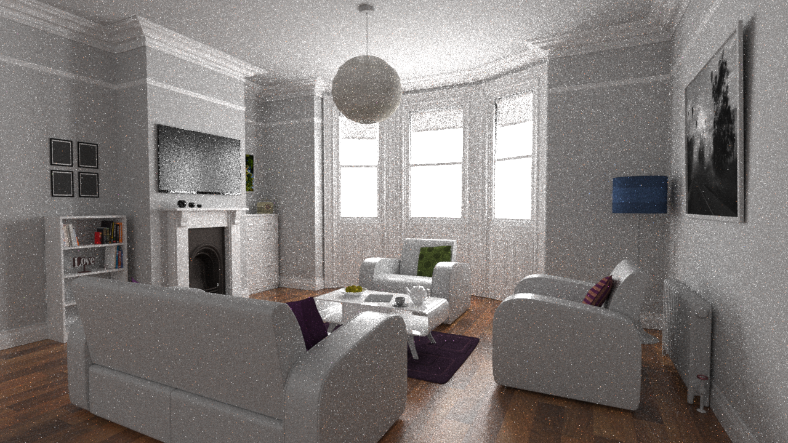
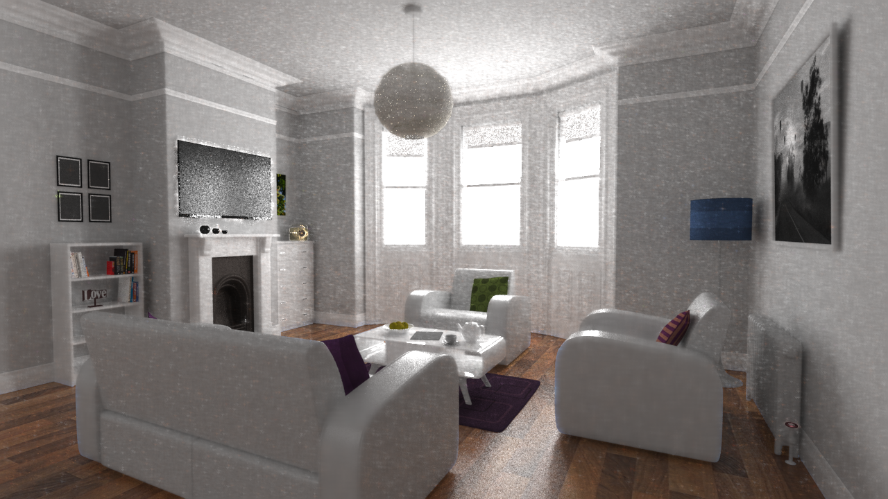

## Unofficial KPCN Implementation (PyTorch)

This repository is an **unofficial PyTorch implementation** of the paper *"Kernel-Predicting Convolutional Networks for Denoising Monte Carlo Renderings"* (Bako et al., 2017).

This project reproduces the KPCN architecture using **PyTorch** for the deep learning model and **Mitsuba 3** for handling EXR data processing. It predicts per-pixel reconstruction kernels to denoise low-sample Monte Carlo renderings using auxiliary feature buffers (albedo, normal, depth, etc.).

### Denoising Results

Here is a comparison between the noisy input (32spp), the denoised output by our KPCN implementation, and the reference image.

<table>
  <tr>
    <td align="center"><b>Noisy Input (32spp)</b></td>
    <td align="center"><b>KPCN Denoised</b></td>
    <td align="center"><b>Reference</b></td>
  </tr>
  <tr>
    <td></td>
    <td></td>
    <td></td>
  </tr>
</table>

### Performance Metrics

Quantitative evaluation was performed on the test scene. The metrics show a significant improvement in both PSNR and SSIM after applying the KPCN denoising.

| Metric | Noisy Input (32spp) | KPCN Denoised | Improvement |
| :--- | :---: | :---: | :---: |
| **PSNR** | 22.99 dB | **27.74 dB** | 🔺 +4.75 dB |
| **SSIM** | 0.4937 | **0.7765** | 🔺 +0.2828 |

### Dataset

* **Source:** [Benedikt Bitterli's Rendering Resources](https://benedikt-bitterli.me/resources/)